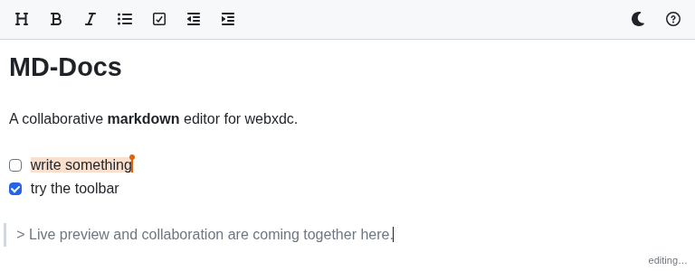

# MD-Docs

A collaborative, **Obsidian-style markdown editor** that runs as a
[webxdc](https://webxdc.org/) app — a single `.xdc` file you send into a chat,
where everyone in the group can edit the same document together, offline-first.



Built on **CodeMirror 6** with a custom live-preview layer (raw markdown that
renders formatting inline as you type), Yjs CRDT collaboration via
[`y-webxdc`](https://codeberg.org/webxdc/y-webxdc), and a touch-friendly editing
toolbar. See [`CREDITS.md`](./CREDITS.md) for inspiration and attribution and
[`PLAN.md`](./PLAN.md) for the design and roadmap.

> Status: early development. See `PLAN.md` for the phased plan.

## Development

### Install

```sh
npm install
```

### Run

Runs the Vite dev server and the [`webxdc-dev`](https://github.com/webxdc/webxdc-dev)
simulator (which provides `webxdc.js` and lets you open multiple simulated peers):

```sh
npm start
```

### Check / lint

```sh
npm test        # typecheck + eslint
npm run fix     # auto-fix lint
```

### Build

Produces `dist-release/md-docs.xdc`:

```sh
npm run build
```

Send the `.xdc` into a chat in any webxdc-capable messenger (e.g. Delta Chat).

To bundle the [Eruda](https://github.com/liriliri/eruda) on-device console:

```sh
ERUDA=1 npm run build
```

### Release

Push a `vX.Y.Z` tag; the GitHub Action in `.github/workflows/release.yml`
builds the `.xdc` and attaches it to a GitHub Release:

```sh
git tag v0.1.0
git push origin v0.1.0
```

Every push and pull request also runs CI (`.github/workflows/ci.yml`):
typecheck, lint and build.
